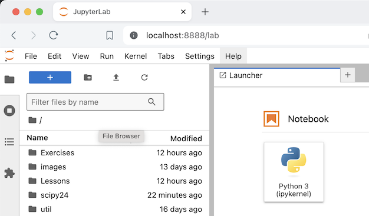

# censusdis-tutorial-2024

This repository contains notebooks to accompany the [SciPy 24](https://www.scipy2024.scipy.org/) tutorial 
[Working with U.S. Census Data in Python: Discovery, Analysis, and Visualization
](https://cfp.scipy.org/2024/talk/BTG9U3/). 

## When and Where

This tutorial will be held live on July 9th, 2024 from 1:30 to 5:30 pm in 
[Room 315](https://tacomaconventioncenter.org/floor-plan-capacities) of the 
[Tacoma Convention Center](https://www.google.com/maps/place/Greater+Tacoma+Convention+Center/@47.2485675,-122.4415581,17z/data=!3m2!4b1!5s0x5490557439af7381:0xf34f9f35c5114bb4!4m6!3m5!1s0x549055744d668161:0xe464395e6d5c8dd5!8m2!3d47.2485639!4d-122.4389778!16s%2Fm%2F04797gw?entry=ttu).
Tickets for this and other tutorials are available at [https://ti.to/scipy/scipy2024](https://ti.to/scipy/scipy2024).
We look forward to seeing you there.

## About the Tutorial

### Objective

The objective of this tutorial is to give attendees immediately applicable skills they can use 
to work with U.S. Census data in Python. The presentation is filled with both practical knowledge 
and examples of best practices for both basic and advanced use cases.

U.S. Census data can be difficult to wrangle, even though vast quantities of it are available via a 
web API. Data sets and variables can be difficult to locate, and geographic hierarchies can be hard 
to manage. Something as simple as querying data for all the census tracts in a metropolitan area that 
crosses state lines can be non-trivial. The [censusdis](https://github.com/censusdis/censusdis) 
package that we will introduce in this tutorial manages this complexity behind a simple interface 
that makes it easy to bring the full set of data and maps the U.S. Census Bureau provides into a 
Python environment.

Armed with a working knowledge of [censusdis](https://github.com/censusdis/censusdis), attendees 
will be able to spend less time wrangling data and more time answering research questions.

This will be a highly interactive hands-on tutorial with plenty of opportunity to write your 
own code to demonstrate what you have learned. In the final part of the tutorial, participants 
will break into small groups, build a notebook of their own to answer a research question, 
and have the opportunity to give a lightning talk about their work to the rest of the participants.

### Format

This tutorial will consist of a series of lessons, each 15-20 minutes in length. Each lesson
will be followed by an interactive exercise where attendees will get a chance to write some
code using the concepts they just learned. Solutions will be provided.

After the lessons and exercises, attendees will break into groups of 2-4 and work on 
one of several available projects. These projects will require attendees to apply several
of the techniques they learned in the lessons and practiced in the exercises to answer
a research question using U.S. Census data. 

Finally, at the end of the session, attendees will have a chance to present the work
they did on their chosen project to the entire group.

## Outline and Approximate Schedule

### (1:30-3:30pm) Interactive introduction to foundational concepts.

- Lesson 0: Environment Setup (10 minutes)
  - **We strongly encourage you to set up your environment in advance.**
  - See the set up section below for details.
  - See also the [Nebari for SciPy 2024 Tutorials](https://docs.google.com/document/d/11YWMZKW6Y4tXnMs3Jekc1S7BQWTR6THZazDaq3WoNxw/edit#heading=h.wtozhevy8waj) guide.

<br>

- Lesson 1: Basic Queries and the American Community Survey (ACS)
    - Basic query requirements
    - Geography
- Exercise 1: Basic queries  

<br>

- Lesson 2:  Maps and More Geographies
    - Styling maps
    - On-spine geographies
    - Off-spine geographies
- Exercise 2: On and off-spine geographies

<br>

- Lesson 3: Variables, Groups, and Data Sets
    - Structure
    - Group Trees
    - Searching for variables and groups
- Exercise 3: Querying beyond the ACS

<br>

- Lesson 4: Data sets with non-geographic filters
    - Introducing the County Business Patterns (CBP) data set
    - NAICS filtering
    - NAICS codes and implied trees
- Exercise 4: Query Filters

<br>

### (3:30-3:40pm) Break

Stretch your legs, get a cup of coffee, tea, or water. Visit the restroom. Don’t check your email.

### (3:40-4:10pm) Advanced geography (time permitting)

- Lesson 5: Advanced Geography
    - (Im)proper nesting of on- and off-spine geographies
    - More mapping features
- Exercise 5: Putting it all together

### (4:10-5:00pm) Small group research projects 

The final part of the session will concentrate on enabling participants to apply what they have learned by 
working together in small groups of 2-4. Each group will choose from one of three research questions, or 
choose one of their own formulation. The instructor will be available for discussion and guidance.

### (5:00-5:30pm) Participant presentations

We will devote the final part of the session to allowing two or three participant groups to very briefly 
present their results to the room.


# Set Up

There are two setup 

## Environment Setup (Nebari)

Thanks to [Quantsight](https://quansight.com/), all participants have access to a web-based Nebari Jupyter notebook environment 
with everything they need for this tutorial pre-installed. We recommend most participants use this option.

**We strongly encourage attendees to set up their environment prior to attending.** 
Creating an account and setting up your own environment only takes about 10 minutes.
But if anything goes wrong it is easier to debug it before the tutorial starts than 
while it is going on.

To set up your environment, please follow the 
[Quantsight Nebari instructions](https://docs.google.com/document/d/11YWMZKW6Y4tXnMs3Jekc1S7BQWTR6THZazDaq3WoNxw/edit?pli=1#heading=h.iiycnjuxtvzz) 
with the following additional details:

- In step 0, the coupon code should have been sent to you by email after you registered for the SciPy tutorials.

- In step 2, choose a medium instance.

- In step 3, we will be using Option 2. The repository URL to clone is https://github.com/censusdis/censusdis-tutorial-2024.git

- Once you have cloned the repository, click through in the Jupyter left-nav to 
  `/censusdis-tutorial-2024/Lessons/Lesson 0 Introduction.ipynb` and run all the cells.

- If you are asked to choose a kernel. Choose `us-census-data-tutorial`.

- We will start here when the tutorial begins. See you there!

## Environment Setup (Local)

If you prefer to set up the tutorial environment locally on your laptop, you can do so.
We assume you have a fresh local virtual environment running Python 3.9 or higher 
(3.12 recommended) and 
`git`. If you are not sure how to set up a virtual environment or what the commands below 
are doing, we suggest you use the Nebari environment instead. It is a simpler approach
for beginners.

### U.S. Census API Key

First, you will need a U.S. Census API key. You can get one by registering 
[here](https://api.census.gov/data/key_signup.html).

Once you receive your key by email, store it in a file in your home directory
as follows:

```shell
mkdir ~/.censusdis
echo "THE-KEY-YOU-RECEIVED-BY-EMAIL" > ~/.censusdis/api_key.txt
chmod go-rwx ~/.censusdis/api_key.txt
```

Note: On Windows, the file should go in `C:\Users\USERNAME\.censusdis\api_key.txt`.
You will have to create the directory and then store the key in that file.

Now your key is set up and ready to go.

### Python Environment

In your virtual env, install `censusdis`, the main package we will use in the tutorial.

```shell
pip install censusdis
```

Verify you have an appropriate version of `censusdis` by running the following:

```python
import censusdis

print(censusdis.version)
```

This should be at least `1.1.14`.

Next, install jupyterlab so we can run the notebooks.

```shell
pip install jupyterlab
```

Now checkout the tutorial code using

```shell
git clone https://github.com/censusdis/censusdis-tutorial-2024.git
```

Alternatively, you can fork this repository and clone your fork.

Finally, verify that you have the lessons checked out.

```shell
cd censusdis-tutorial-2024 
ls Lessons 
```

You should see the lesson notebooks as follows:

```
Lesson 0 Introduction.ipynb     Lesson 3 Variables.ipynb
Lesson 1 Basic Queries.ipynb    Lesson 4 Query Filters.ipynb
Lesson 2 Maps.ipynb             Lesson 5 Advanced Geography.ipynb
```

Now start Jupyter with

```shell
jupyter-lab &
```

This should start the server and open a browser pointing to it. The window will look
something like this:



You are now ready to go. Bring your laptop to the tutorial and we will jump right in.
